# **About Project**
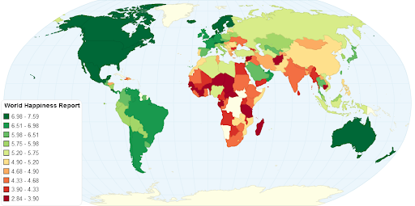

### **Context**

The World Happiness Report is a landmark survey of the state of global happiness. The first report was published in 2012, the second in 2013, the third in 2015, and the fourth in the 2016 update. The World Happiness 2017, which ranks 155 countries by their happiness levels, was released at the United Nations at an event celebrating International Day of Happiness on March 20th. The report continues to gain global recognition as governments, organizations, and civil society increasingly use happiness indicators to inform their policy-making decisions. Leading experts across fields - economics, psychology, survey analysis, national statistics, health, public policy, and more - describe how measurements of well-being can be used effectively to assess the progress of nations. The reports review the state of happiness in the world today and show how the new science of happiness explains personal and national variations in happiness.

### **Content**

The happiness scores and rankings use data from the *Gallup World Poll*. The scores are based on answers to the main life evaluation question asked in the poll. This question, known as the Cantril Ladder, asks respondents to think of a ladder with the best possible life for them being a 10 and the worst possible life being a 0 and to rate their own current lives on that scale. The scores are from nationally representative samples for the years 2013 - 2016 and use the Gallup weights to make the estimates representative. The columns following the happiness score estimate the extent to which each of six factors - economic production, social support, life expectancy, freedom to make life choices, absence of corruption, and generosity - contribute to making life evaluations higher in each country than they are in Dystopia, a hypothetical country that has values equal to the world's lowest national averages for each of the six factors. They have no impact on the total score reported for each country, but they do explain why some countries rank higher than others.

The following columns: GDP per capita, Social support, Healthy life expectancy, Freedom (Freedom to make life choices), Trust (Government corruption) describe the extent to which these factors contribute in evaluating the happiness in each country.

# Dataset
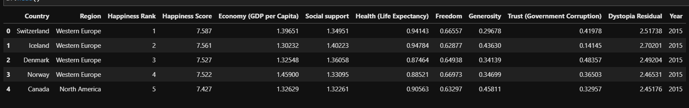

# Objectives

Objectives of analysis are:
1. Find out which factors really affecting happiness score of a country;
2. Elaborate analyisis on countries having high Rank in Happiness Score and countries that don't, also elaborate in attribute region
4. Determine what efforts need to be done for countries having low happiness score

Therefore, the target column is: *Happiness Score*
#
# Analysis

## Statistical Analysis

1. Statistic Description of Data
    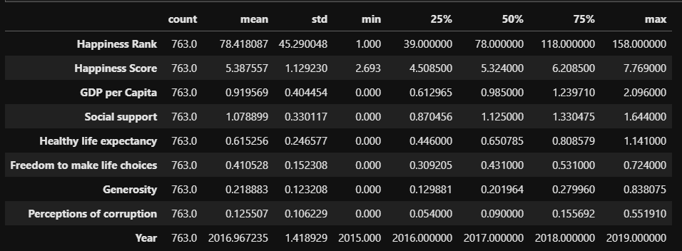

    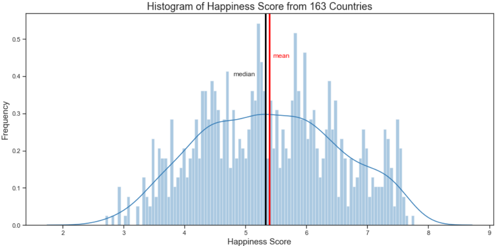
    Minimum Happiness score is 2.693 and the maximum score is 7.769, the value for mean and median are close together, they are 5.38 and 5.32, respectively.

2. Pearson Correlation Heatmap
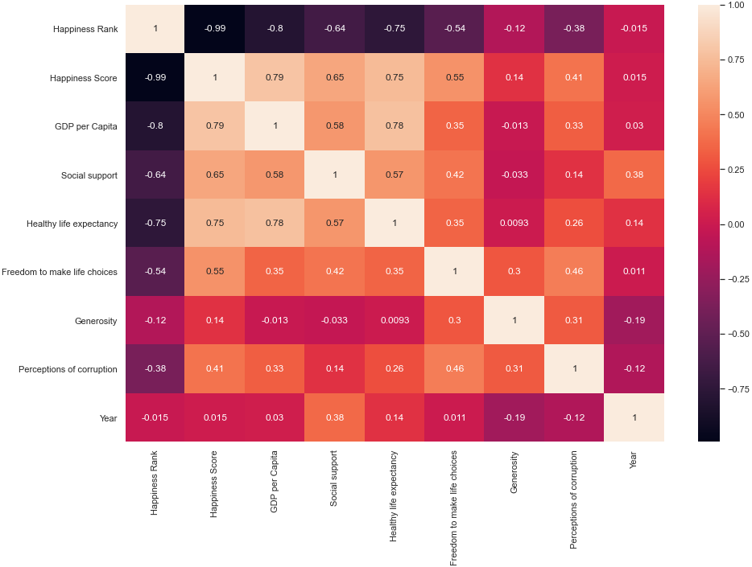

    Feature having correlation score of more than 0.5 with Happiness Score are:
    - Freedom to make life choices (0.55)
    - Social support (0.65)
    - Healthy life expectancy (0.75)
    - GDP per Capita (0.79)

    All features mentioned above are positively correlated with happiness score.

## Analysis on Countries Having High Happiness Score
#
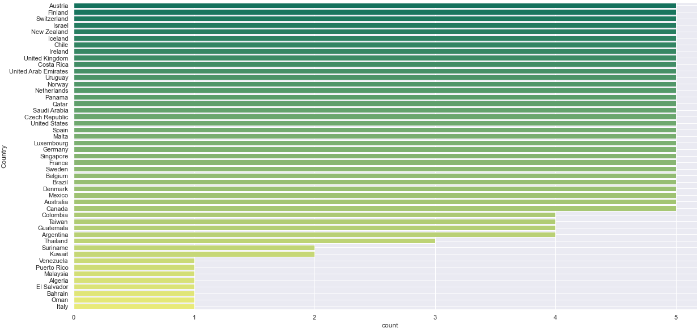
Picture above shows the number of a country mentioned on the list of the state with high Happiness Score (quartile 3).

There are 8 countries that only occur once in this group, they are:

- Italy
- El Salvador
- Malaysia
- Algeria
- Bahrain
- Oman
- Venezuela
- Puerto Rico

Next analysis is to find out things that are done by these countries to make a breakthrough to enter group with high Happiness Score, and/or to find out things that make these countries exit the group (with high Happiness Score).

Some countries only recorded one time (only one year), so it's needed to evaluate these countries from the original data.

## Analysis per Region
#
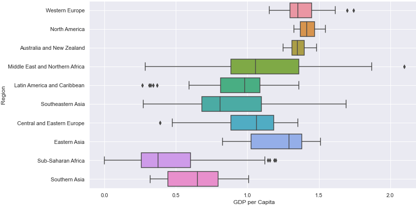
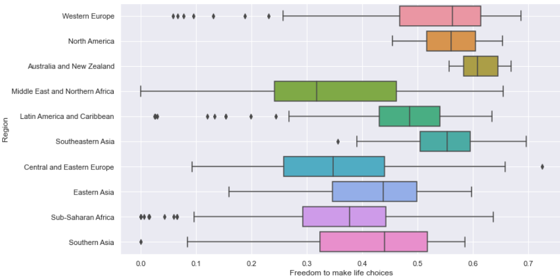
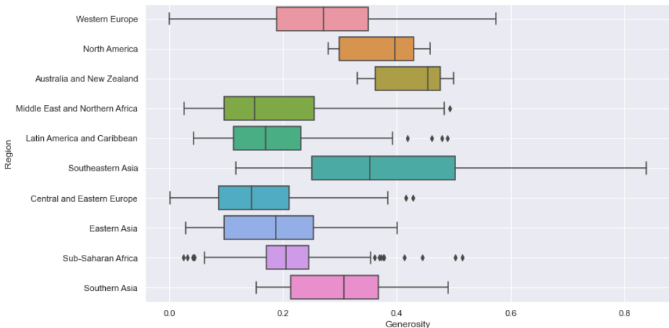
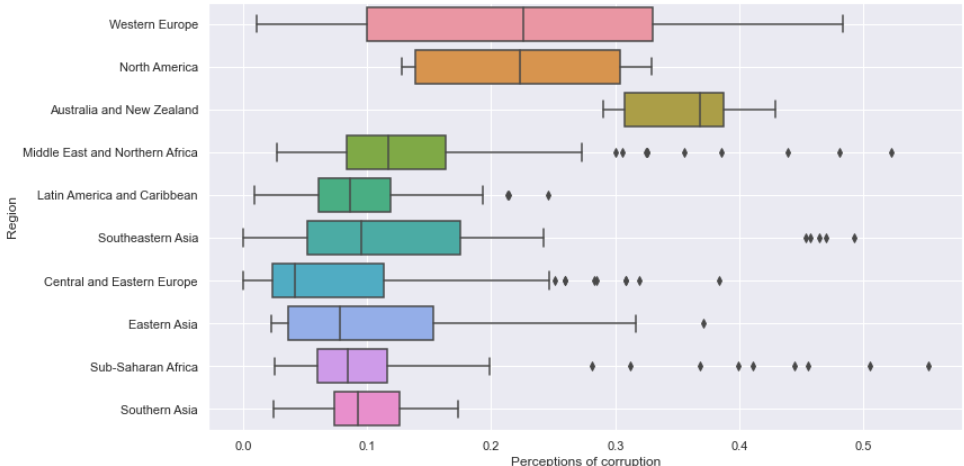

In general, GDP per Capita is the main thing that determines happiness index of a country. Countries already having high GDP per Capita value might need other factors such as healthy life expectancy, social support, freedom to make life choices, generosity, and perceptions of corruption. But GDP per Capita is the primary thing that must be prioritized. Because when GDP is low, workers may be retrenched and/or paid lower wages, and it will result in domino effect to other socioeconomic sectors which furthermore will also (indirectly) affects the healthy life expectancy and overall public welfare.
#
# Conclusion

1. Factors contribute to Happiness Score are: GDP per Capita, Healthy life expectancy, Social support, and Freedom to make life choices. All features are positively correlated with overall Happiness Score.
2. Western Europe has most countries ranked in quantile 75 of Happiness Score, while Sub-Saharan Africa countries are most likely to be found on quantile 25. 
3. GDP per Capita is the main thing that determines happiness index of a country, so it must be the primary thing to prioritized to improve the overall public welfare of a country.

# Suggestions
Efforts to improve purchasing power of the community and economic activity can be done by giving economic stimulation to excite microeconomics in the community such as "Koperasi" in Indonesia (Cooperative).

Improving tourism business also can be done to attract foreign tourist therefore it could increase economic transaction in the community.

# **Machine Learning Model**
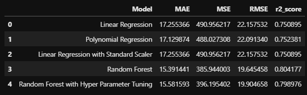
Model with best r2_score is achieved by RandomForestRegression model with default parameters. R2 square score is 0.8

# **Dashboard**
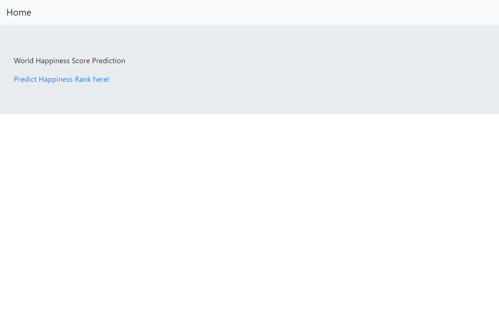
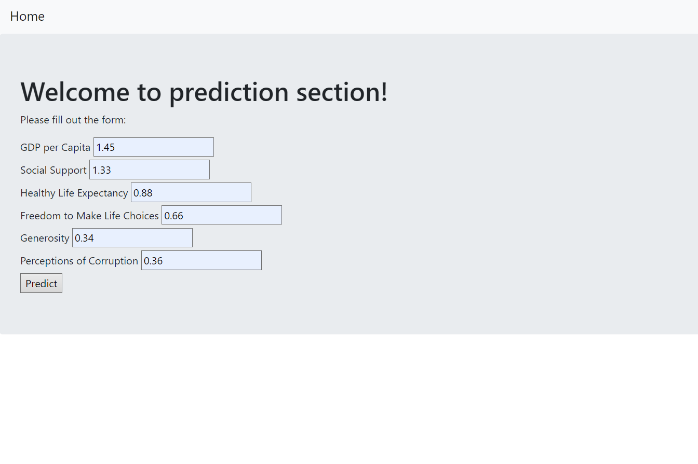
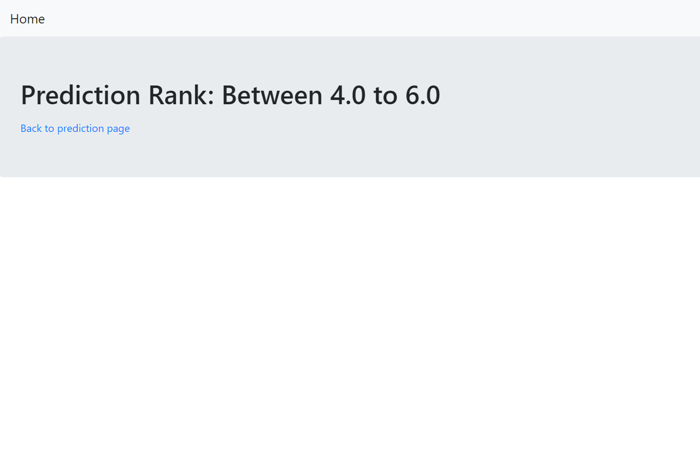

## **Thank You**